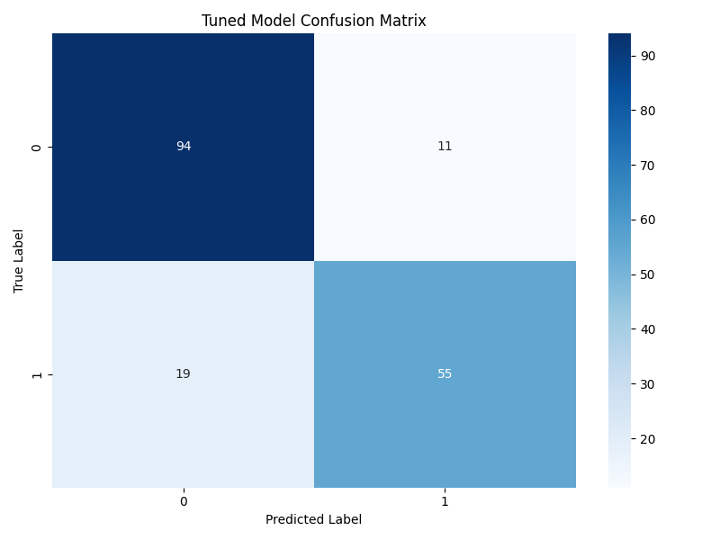

# Titanic Survival Prediction Model with XGBoost
<p align="center">
  <a href="https://youtu.be/feOO7DOKnqQ?si=rFT9jCzVhsqnGJS8">
    
  </a>
  <br/>
  <em>Click the thumbnail to watch on YouTube</em>
</p>

This repository contains Python scripts that build and evaluate XGBoost classifiers to predict passenger survival on the Titanic, based on a preprocessed dataset. The project includes an original untuned model and an enhanced model optimized using GridSearchCV for hyperparameter tuning.

## Overview

The scripts use machine learning to analyze the Titanic dataset and predict whether a passenger survived (1) or not (0). They include data preprocessing, model training, evaluation, and visualization of results. The tuned model leverages GridSearchCV to systematically test hyperparameter combinations, improving performance over the untuned model.

## Features

- Loads and processes a pre-scaled dataset (`train_scaled.csv`).
- Trains an XGBoost classifier with optimized settings (untuned and tuned versions).
- Splits data into training (80%) and test (20%) sets.
- Evaluates model performance with accuracy, precision, recall, f1-score, and classification report.
- Visualizes the confusion matrix as a heatmap.
- Saves predictions to CSV files.
- Uses GridSearchCV with 5-fold cross-validation to optimize hyperparameters (`n_estimators`, `max_depth`, `learning_rate`) in the tuned model.

## Requirements

- Python 3.x
- Required libraries:
  - `pandas`
  - `xgboost`
  - `sklearn`
  - `matplotlib`
  - `seaborn`

Install dependencies using:
```bash
pip install pandas xgboost scikit-learn matplotlib seaborn
```

## File Structure

- `data/train_scaled.csv`: Preprocessed dataset with features and target variable.
- `titanic_model_xgboost.py`: Original Python script for untuned model training and evaluation.
- `titanic_model_xgboost_tuned.py`: Python script for tuned model with GridSearchCV.
- `data/predictions.csv`: Output file containing actual vs. predicted survival outcomes (untuned model).
- `data/titanic_xgb_tuned_predictions.csv`: Output file containing actual vs. predicted survival outcomes (tuned model).
- `images/confusion_matrix_xgb_tuned.png`: Confusion matrix visualization for the tuned model.

## Usage

1. Ensure all dependencies are installed.
2. Place your preprocessed `train_scaled.csv` in the `data` folder.
3. Run the scripts from the command line in the project directory (`C:\Users\ri\OneDrive\ai project\model\titanic_model_xgboost`):
   ```bash
   python titanic_model_xgboost.py  # For untuned model
   python titanic_model_xgboost_tuned.py  # For tuned model
   ```
4. Check the console for classification reports and view the confusion matrix plots.
5. Find predictions in `data/predictions.csv` (untuned) and `data/titanic_xgb_tuned_predictions.csv` (tuned).
6. View the tuned model's confusion matrix in `images/confusion_matrix_xgb_tuned.png`.

## Dataset

The scripts expect a CSV file (`train_scaled.csv`) with columns including `Survived`, `PassengerId`, and various features (e.g., `Pclass`, `Age`, `Sex_male`, etc.). The features are pre-scaled (e.g., normalized numerical values, one-hot encoded categorical variables). The first two rows of a sample dataset are:
- `PassengerId,Survived,Pclass,Age,SibSp,Parch,Fare,Sex_male,Embarked_q,Embarked_s,Deck_B,Deck_C,Deck_D,Deck_E,Deck_F,Deck_G,Deck_T,Deck_Unknown`
- `1,0,3,-0.5348911628688886,0.4327933656785018,-0.4736736092984604,-0.5641087873940193,True,False,True,False,False,False,False,False,False,False,True`
- `2,1,1,0.6683917564561223,0.4327933656785018,-0.4736736092984604,0.9425480546638041,False,False,False,False,True,False,False,False,False,False,False`

## Results

### Untuned Model
- **Accuracy**: ~82% (based on original script output).
- **Output**: Classification report and confusion matrix visualization.
- **Predictions**: Saved in `data/predictions.csv`.

### Tuned Model
- **Best Parameters**: `{'learning_rate': 0.1, 'max_depth': 3, 'n_estimators': 100}`
- **Best Cross-Validation Accuracy**: 0.8328 (average accuracy across 5-fold cross-validation).
- **Test Set Accuracy**: 0.8324
- **Classification Report**:
  ```
              precision    recall  f1-score   support
           0       0.83      0.90      0.86       105
           1       0.83      0.74      0.79        74
    accuracy                           0.83       179
   macro avg       0.83      0.82      0.82       179
  weighted avg       0.83      0.83      0.83       179
  ```
- **Output**: Classification report and confusion matrix visualization saved as `images/confusion_matrix_xgb_tuned.png`.
- **Predictions**: Saved in `data/titanic_xgb_tuned_predictions.csv`.

### Comparison
- **Accuracy Improvement**: The tuned model's test set accuracy (0.8324) improved by approximately 1.24% over the untuned model's accuracy (~0.82). This modest improvement indicates that hyperparameter tuning enhanced the model's ability to generalize to the test set.
- **Impact of Tuning**:
  - **Hyperparameters**:
    - `learning_rate: 0.1`: A moderate learning rate balances the speed of learning with stability, allowing the model to converge effectively without overshooting optimal weights.
    - `max_depth: 3`: A shallow tree depth reduces the risk of overfitting by limiting model complexity, ensuring the model captures key patterns without memorizing noise in the training data.
    - `n_estimators: 100`: Using 100 boosting rounds provides sufficient iterations for the model to learn robust patterns while keeping computational cost reasonable.
  - **Performance Insights**: The tuned model improved recall for non-survivors (0.90) compared to survivors (0.74), indicating better identification of passengers who did not survive. Precision is balanced (0.83 for both classes), suggesting consistent performance across classes. The slight accuracy improvement reflects better generalization, likely due to the optimized `max_depth` preventing overfitting and the `learning_rate` enabling stable updates to the model's weights.
  - **Cross-Validation**: The cross-validation accuracy (0.8328) closely matches the test set accuracy (0.8324), indicating robust performance and low variance across different data splits.

### Confusion Matrix (Tuned Model)

The confusion matrix visualizes the model's performance, showing true positives, true negatives, false positives, and false negatives for the survival prediction task.

## Contributing

Feel free to fork this repository and submit pull requests for improvements or bug fixes. Suggestions for additional hyperparameters, feature engineering, or alternative models are welcome.

## License

This project is open-source. See the [LICENSE](LICENSE) file for details (if applicable).